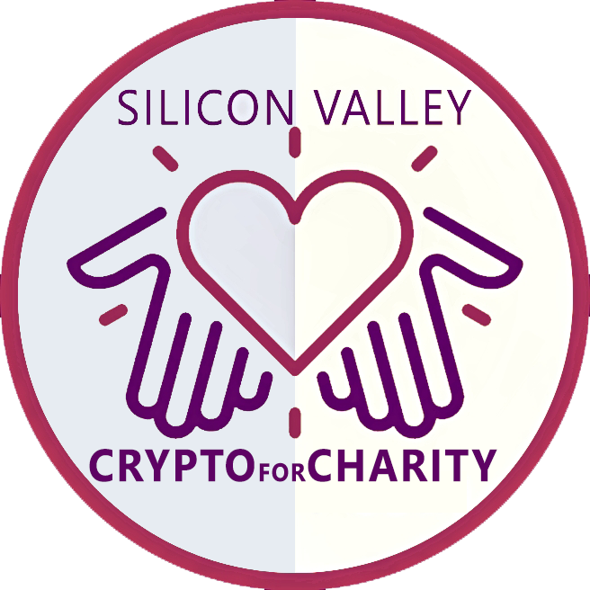

# Silicon Valley Crypto for Charity (SVCFC)

SVCFC is a deflationary token currently deployed on the Ethereum Ropsten Testnet under contract [0x4C8C16B4a5c5866fe3BBE0f0cb1d9950A3fE947E](https://ropsten.etherscan.io/token/0x4C8C16B4a5c5866fe3BBE0f0cb1d9950A3fE947E).

This is a non-profit effort with big ambitions to revolutionize the world of decentralized finance.




## Donations to Charity

SVCFC focuses on supporting the global economy through charity donations. We have selected 12 charities that will receive support from this project.
For every transaction, 0.5% of the transaction is sent to the one of these charities. This project is described as follows.
- [The Giveth Community of Makers ](https://giveth.io/project/giveth)
  > The Future of Giving is Now! We have softly launched our second dApp from the Giveth community of makers, this free, open-source, and decentralized application for peer-to-peer donations you are using right now. Donations such as yours are our primary source of funding and are deeply appreciated! In the current evolution of Giveth we're building upon firsthand experience gained through developing, maintaining and improving our original flagship dApp (live at beta.giveth.io). For 3+ years, all funding for Giveth has been tracked transparently, securely and accountably here using the full-featured version with DAC’s, Campaigns and Milestones. This new dApp is starting out with a simple purpose: For Givers: Offer the best experience for anyone looking to donate to a cause, whether with crypto or a credit card. For Makers: Enable project creators anywhere in the world to start accepting donations in a few minutes, with zero fees and zero censorship. We know that the future is what we make it, and at Giveth everyone is a Giver AND a Maker.. Your questions, suggestions and preferences are needed to guide the team in deciding what features and functionality to build next. Ways to contribute: Donate today and feed the team! Click the “Feedback” button to submit your ideas! Connect with us at join.giveth.io so we can welcome you personally to the Future of Giving!
- [Bridging Digital Communities ](https://giveth.io/project/Bridging-Digital-Communities-1)
  > I run a bridge server for chats (Discord, Telegram, Riot, ...) and am actively engaging communities connected to the Ethereum space. Especially with the advent of newDAOs my services are being requested on a regular basis. Most requested at the moment is bridging between community servers on Discord (both communities get to share a room), whereas before it was mostly mirroring rooms between different protocols. Once a bridge is up, it still needs to be maintained and I regularly check that everything is in working order. I never charge for these services, but I do accept donations (all Ethereum tokens)
- [The Commons Simulator: Level Up! ](https://giveth.io/project/The-Commons-Simulator:-Level-Up)
  > The Commons Simulator is a gamified simulation tool powered by a cadCAD backend that was developed by the Commons Stack's Decentralized Dev community. The intention is to blend art and simulation into a dystopian sci-fi storyline. In the game, you travel back in time to use cadCAD as a tool to help a community design a regenerative Commons with the potential to save the world from total planetary and economic destruction.
- [AmwFund ](https://giveth.io/project/AmwFund)
  > AmwFund is the digital asset fundraising ecosystem that supports AM Winn's Community Guild (PTO), a registered 501 (c)(3) non-profit and our school's primary fundraising entity.
- [Colorado Multiversity ](https://giveth.io/project/colorado-multiversity)
  > Fundación Madre Tierra Verde (FMTV) aims to contribute to Costa Rica's transition to a green and intelligent society paradigm, following the guidelines of the National Climate Change Strategy (ENCC) and the Decarbonization Plan, through the guidance, advice and equipment of companies, organizations, communities, and governments. Based on the climate change agenda, we focus on the following axes of work: capacity building and technology transfer, financing, public awareness, and culture creation. The Colorado Multiversity project is an initiative that seeks to create an academic and research space with a methodology focused on people and their interaction with the environment, with partnerships and collaborations with projects, organizations and initiatives that feed on content to be able to train and empower communities on issues that benefit the Sustainable Development Goals. The multiversity campus consists of more than 1000 Ha at the Barra del Colorado National Wildlife Refuge in Pococí, Limón, at the North Caribean of Costa Rica, and at the outset will have facilities to accommodate up to 50 students, starting with the Disaster Care program in conjunction with Refuge Project, the Citizen Innovation Laboratory in conjunction with SIFAIS Lab and the Precision Agriculture Training Center , in addition to the Volunteering Programs with universities in the United States and Europe and the Community Precious Plastic Collection Center. This project is supported by the Spanish Cooperation, Gaia Gives, SDG Impact Fund, the United Nations International Organization for Migration. The need for capital is to start the infrastructure development project while reaching the necessary progress to receive the contributions of international cooperation and starting to operate with the first programs in June 2021. Next, we share a video that we prepare to better illustrate what the project is about.
- [Free The Food](https://giveth.io/project/free-the-food)
  > Streetside Syntropic. We empower people and communities around the world to plant their streetsides with food. Using Permaculture and Syntropic farming techniques, fruit trees, edible plants, and other companion plants are combined to create a circular and regenerative food system. Why Streetside? All over the world there are streets with empty sides. We convert these spaces into micro food forests to provide free food for the community and spread the message of Syntropic techniques. Planting in this way also builds habitat for wildlife and restores ecological diversity. Why Syntropic? It is one of the most successful and harmonious growing methods for rehabilitating land and growing food. Syntropic agriculture mimics the evolution of a forest and uses techniques to accelerate growth, generate biomass to build soil, and continuously remove CO2 from the air. This successional planting method is a permanent and evolving system that provides food forever. How It Works? We provide Syntropic education, step-by-step guidance, and micro-grants to help communities start and maintain a fruitful streetside. These teams use social media to share the evolution of their planting journey while also seeding Syntropic knowledge worldwide. We use discord as a forum to discuss, share, and learn together. We provide 100% transparency with donation allocation and use of funds. 501c3 coming soon. We currently have 3 streetsides planted in Costa Rica with 2 more waiting to be planted. We are also developing a community food forest on a donated piece of land. This is the pilot project for phase 2. We are currently seeking donations for website development, 501c3 incorporation, legal advice, tools, seeds/trees, water tanks, irrigation drip line, and $100USD/month for 1 person. Thank you for your contributions to help heal soil, sequester carbon, and grow food for the world!
- [Diamante Luz Center for Regenerative Living ](https://giveth.io/project/diamante-luz-center-for-regenerative-living)
  > Diamante Luz gathers like-minded individuals who are passionate about land stewardship and building conscious intentional community to work together to restore lands and protect precious water resources by strengthening connection to local culture and lands, by building a transitional village designed to support optimal human development while regenerating local ecosystems, and by stepping into a new way of living in harmony with each other and the earth.
- [Bloom Network ](https://giveth.io/project/bloom-network)
  > Bloom Network is an international community of people and projects working toward regenerative cultures. Local Bloom hubs around the world grow participation in practices such as food security, local economies, celebrations of diversity, and art as cultural transformation. There are 16 local Blooms in 7 countries on 4 continents, and we estimate there are approximately 30,000 people involved on the ground. Our participants include farmers, creatives, Indigenous leaders, and professionals who are working together in coalitions. Our big picture goals: 1. Inspire a billion acts of regeneration 2. Build capacity and relationships across regenerative culture initiatives 3. Transfer power and resources to decentralized networks Why are we doing this? There are tens of thousands of initiatives solving major social and environmental problems, who are excluded from mainstream media and institutional finance because the way they work is naturally collaborative and polycentric. Now that Web3 is useable enough by a non-technical audience, we will implement a membership model to support grassroots organizing on an ongoing basis. Your contributions to this project will go toward these milestones: + Complete a "Regenerative Actions Ticker" on our homepage, to document and reward actions like planting food forests, hosting a CryptoParty, or teaching a class on restorative justice. + Code DAO templates that local Bloom chapters can use to fund the coordination labor of actions such as regional food security, policy development, mutual aid, and startups that generate ongoing financial stability. + Launch our "Call to Bloom" to help 100+ local Blooms get started as centers of regenerative action in their cities.
- [Diamante Bridge Collective ](https://giveth.io/project/diamante-bridge-collective)
  > The Diamante Bridge Collective (DBC) is a group of land stewards in the Diamante Valley working together to create collective foundational agreements and a local regenerative economy that includes digital currencies for the transparent and accountable recordkeeping of our exchanges. We are building bridges between communities and organizations, local and global cultures, property owners and skilled service providers in the Southern Zone of Costa Rica who are committed to working together long term to care for our bioregion, our neighbors, and ourselves. The DBC functions as a hub of many physical nodes, connected via global networks of shared vision and missions with the goal of restoring, preserving and consciously stewarding surrounding lands and watersheds while living harmoniously within them in alignment with our planetary values.
- [Women of Crypto Art (WOCA)](https://giveth.io/project/women-of-crypto-art-(woca))
  > Hello world! We are the Women of Crypto Art! Women of Crypt Art (WOCA) is a new community group formed to highlight and promote, collaborate and support any artist who identifies as a woman in the crypto art space. As a community we come together to share ideas, information, tips and general support in all things crypto art. We are an inclusive group and also welcome women collectors, and curators, as well as anyone who supports our goal to make women more visible in the crypto art space. Our mission is to ensure the crypto art world has a diversity of voices by being a welcoming space, creating exhibitions and events, providing educational materials for those just starting out through to professional level, and championing the diverse voices of our members. In the short 6 months since we began, we have: - grown to over 400 members on our Discord server - launched our full website where members can showcase their art and writings - created a Colony DAO instance and begun to set up funding for our teams - created a Sourcecred instance to track the value that our members create - acquired a permanent exhibition space in Cryptovoxels (thank you for your generosity @GiselX!) - have become a member of the Panvala League - finalised a soon to be released artwork which is our first art collaboration together! Our next milestones are building our permanent gallery, onboarding everyone to the DAO and putting funding in place for the teams doing the amazing work of promoting women artists. Your contribution here ensures that our community can continue to grow & will enable us to do all of these great things .... together. Be seen. Be heard. Be welcome. Be WOCA!
- [Commons Stack: Iteration 0](https://giveth.io/project/commons-stack:-iteration-0)
  > The Commons Stack Community is setting up our Swiss Association, working with our first user, the TE Commons, and focusing on solidifying the Cultural Build for future Commons. We will use the funds we raise in this campaign to assemble the core team, support the TE Commons' Cultural Build, build a community around cadCAD and our the Trusted Seed, improve our website and most importantly, create a repeatable template that communities can use to create Commons!
- [MyCrypto](https://giveth.io/project/mycrypto)
  > If you've ever held Ethereum, chances are you've heard of or even used MyCrypto. MyCrypto enables you to create, connect, and manage all of your Ethereum wallets in one place -- and we don't compromise your security or your privacy. We aim to make your crypto life safer, easier, and more private, and your contributions help us do that.


## Eco-friendly Finance

The goal of this project was to be lightweight and built on a proof-of-stake (PoS) consensus protocol. The lightweight nature of the coin ensures that no gas is wasted, and PoS enables the token to have a low impact on the environment, avoid all unnecessary computation, and have high throughput during network congestion. By donating 0.5% of every transaction SVCFC supports the building of habitats and restoration of wildlife and ecological diversity, and general improvements to the global status.


## Supply and Future Ambitions

The deflation occurs by burning 0.5% of every transaction, which not only limits the supply, but incentivises holding it due to the increasing rarity. The initial token supply was 2 billion SVCFC. 1 billion of the token will be burned, and the other half will be sent to a smart contract for management with future exchanges.


## How to Buy

Currently, the token is deployed to the Ropsten testnet. Once the token has been determined secure, we will migrate the project to the _mainnet_ and update this page.
<!-- Using the [TrustWallet](https://trustwallet.com/) app (or any Smart Chain wallet), navigate to the DApp: [PancakeSwap](https://exchange.pancakeswap.finance/#/swap?outputCurrency=ADDRESS), and connect your wallet by selecting "Connect".

In the "From" field, select the token you'd like to transfer, then in the "To" field, enter the smart contract for SVCFC:
```
0x7ed52b30ae68463a21994371c3a77d18dd144fc8
```
If the transaction fails, be sure to incrementally increase the slippage percentage within the PancakeSwap settings. At the time of writing this, 6% is the minimum slippage for a successful transaction.

## How to Contribute

The PancakeSwap liquidity pool is what determines the price of SVCFC. By contributing a combination of both BNB and SVCFC to the pool, this will allow the exchange enough liquidity to swap between the tokens in higher volumes. Not only is this beneficial to the token by reducing the slippage, but it also gives all contributors rewards in the form of Pancake LPs. When the demand for the token is high, contributors will see high profitability.

To become a liquidity pool contributor, navigate to the "Liquidity" tab in PancakeSwap. Similar to token swapping, paste the contract address for SVCFC, select the amount of SVCFC and another token to contribute, then select the "Supply" button. -->

---
**Thank you.**
